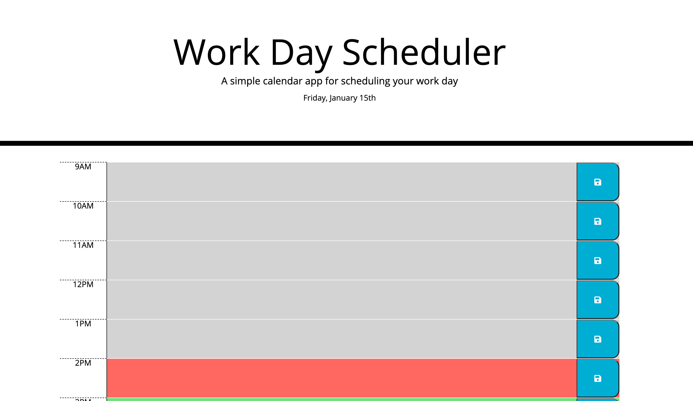
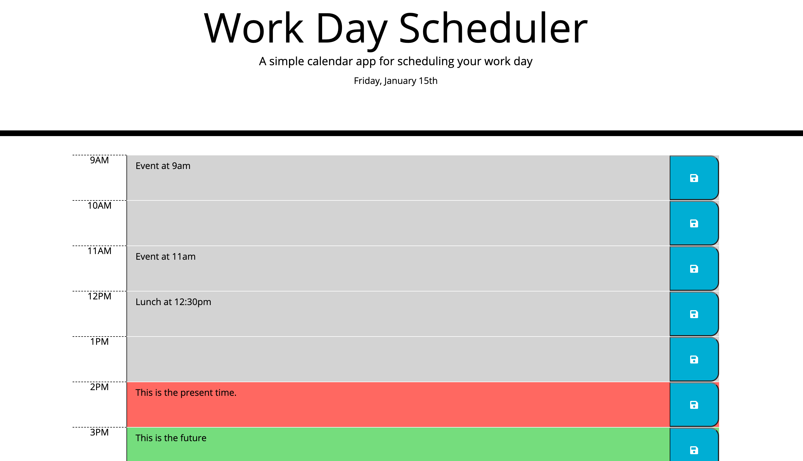

# Stephanie's Workday Scheduler

## Description 

This web application is a daily planner to schedule out the day. When it is opened, the current day is displayed at the top of the calendar. When the user scrolls down there are time blocks for standard business hours. When viewing the schedule, each time-block is color-coded to indicate whether it is in the past, present or future.

When the user clicks on a time block, they can enter an event. Entering events in time blocks already passed for the day are allowed, as it is assumed the user is creating a schedule that can be used for the work day with recurring events each day. A listing of events with the return or enter key are allowed in the time block. 

The user clicks the save button for that time block to save the event. Please note that I added the ability to save the new scheduled event by clicking outside of it on a blur event to practice using blur (this was not what the challenge instructions said to do, so I hope it is OK).

When the page is refreshed the saved events remain on the schedule. The page is refreshed every 15 minutes so that past/present/future events will update their visual effects.

This JavaScript code contains skills I recently learned including accessing localStorage to save and retrieve data, using jQuery to listen for blur and click events and to add responsive HTML (like the date and updated text areas). I also used Bootstrap grid to lay out the schedule, awesomefonts to grab an icon, and momentjs to manipulate times.

## Screenshots of web application 

## Link

[Link to Stephanie's Workday Scheduler applicaton](https://sgiel.github.io/workday-scheduler/)

